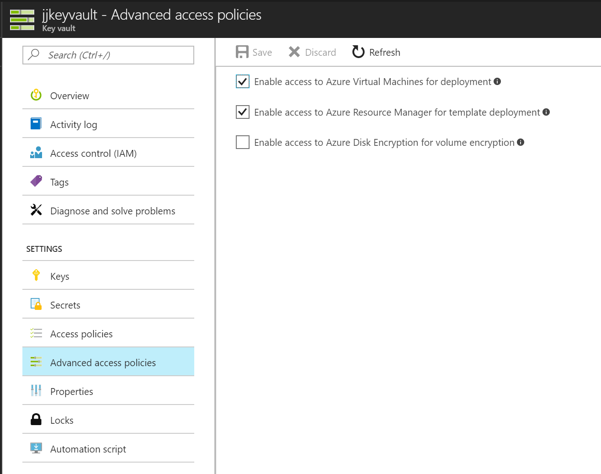
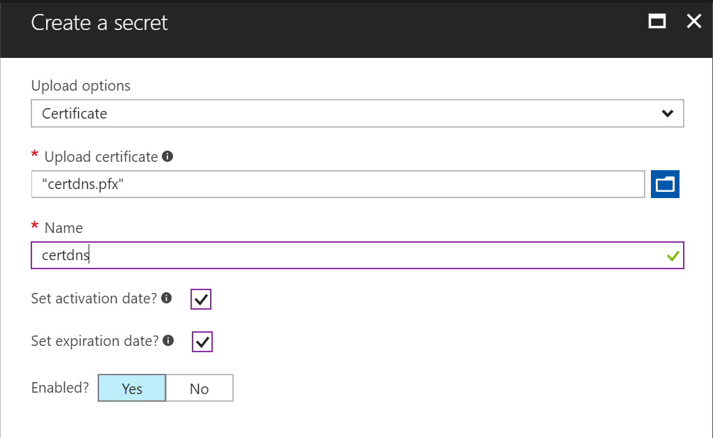
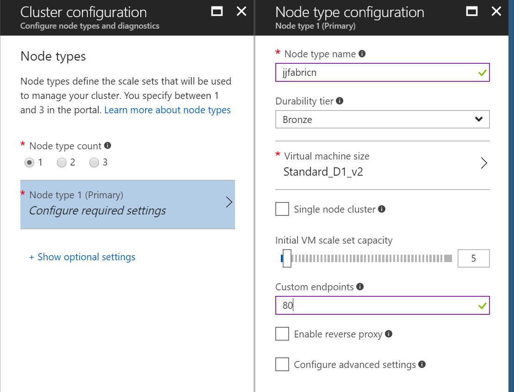
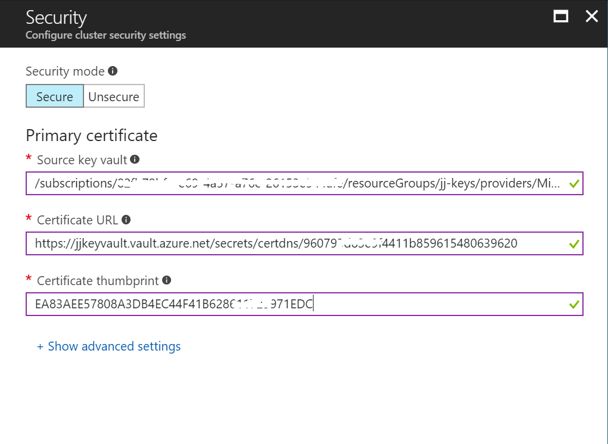
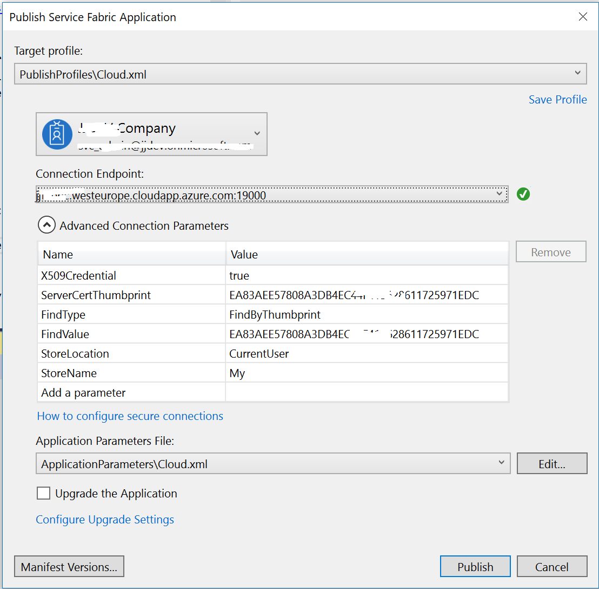

# JJ Azure ServiceFabric sample
This repo contains ServiceFabric sample with one service. This service is using encrypted secret (password) which can be used for e.g. access another resource like queue, database etc.
Following setup support 2 different environments, local development and Azure deployment - using different configurations.

## Encrypted service JJFabric.EncryptedSvcApi
This service implements how to encrypt secrets in ServiceFabric. Api service returns encrypted value from encrypted secret stored in fabric configuration.
ServiceFabric documentation (https://docs.microsoft.com/en-us/azure/service-fabric/service-fabric-application-secret-management)

### Step 1 - Create certificate
Creating self-signed certificate for demo. Check with certmgr.msc certificate has been created.
```PowerShell
.\Scripts\prepare.ps1
```
Or you can use certificate stored in Scripts folder, simply insert it in Computer Certificate Store (MMC Manage Computer Certificates).

### Step 2 - Encrypt value "mojeheslo"
```PowerShell
.\Scripts\encrypt.ps1
```

### Step 3 - Add secret into fabric code
Add secret into service settings file, change value with encrypted value
```Xml
  <Section Name="JJConfigSection">
    <Parameter Name="JJHeslo" IsEncrypted="true"  Value="MIIBrwYJKoZIhvcNAQcDoIIBoDCCAZwCAQAxggFHMIIBQwIBADArMBcxFTATBgNVBAMMDGpqZmFicmljY2VydAIQZPR+6QCuwYJF2S0dq0BOfDANBgkqhkiG9w0BAQcwAASCAQBL2/uRa3Roup5ycfURdQHoh3faTjmW/0WID7UK0+NsQTbzEAeO6PGRn+FZ/ZLNSZOv8S2kprznQrNQdnkP18EFo7B0J/SZsHEsLGOxu2qYv061JhnI5DPYU3EwpXXxGSaSMLfAF8j++Ta+68jXejv9V1Cm+0R0Du2PEBZVtDELcb1oHR4Yel3gVxWJTbpUEEmM6iniI1SDUfwGEExP1WOQLnwImnGAG1GOWT3Yd52URkJ6c8hIvGwg3QwGcObeq5Brf05djhuqhZoQf5PgiEDsLuKUY56IAgEEVGyODTqt/fzDJI5INZNygPbU0iaeaQof+unWglZkGMpqFKfbPCvqMEwGCSqGSIb3DQEHATAdBglghkgBZQMEASoEEKuQrcetGQ9S4icdCAXPuK2AINyGXAqSsc22bUMHwDfOKmWW9v/uUMwX7NjHLvjlGIiU" />
  </Section>
```
btw, you can override this value durring application deployment process -> define in ApplicationManifest ConfigOverrides

Next, add thumbprint into ApplicationManifest.xml
```Xml
  <Principals>
    <Users>
      <User Name="EncryptedSvcApi" AccountType="NetworkService" />
    </Users>
  </Principals>
  <Policies>
    <SecurityAccessPolicies>
      <SecurityAccessPolicy GrantRights="Read" PrincipalRef="EncryptedSvcApi" ResourceRef="EncryptedSvcApiCert" ResourceType="Certificate"/>
    </SecurityAccessPolicies>
  </Policies>
  <Certificates>
    <SecretsCertificate Name="EncryptedSvcApiCert" X509FindType="FindByThumbprint" X509FindValue="37B63D21204C52E6F1163C198AE67C055008B6BD"/>
  </Certificates>
```

### Step 4 - Test locally
Open Visual Studio project and deploy into local ServiceFabric.
Check port in ServiceManifest.xml and start browser (http://localhost/api/values/5)

## Deploy ServiceFabric in Azure
Following steps describes how to deploy this ServiceFabric service into Azure ServiceFabric. Service running in Azure is using different certificate to decrypt secrets.
Certificate is used for SSL communication and for access to secrects. When a cluster is deployed in Azure, the Azure resource provider that's responsible for creating Service Fabric clusters pulls certificates from Key Vault and installs them on the cluster VMs.
See more in documentation (https://docs.microsoft.com/en-us/azure/service-fabric/service-fabric-cluster-creation-via-arm).

## Step 1 - Create certificate
Create new self signed certificate with full dns name for Azure ServiceFabric. In my case jjfabric.westeurope.cloudapp.azure.com.
Certificate must have several key usages (without them ServiceFabric will crash), including Document Encryption (to encrypt secrets)
To generate certificate is better to use this extension (allow generate certificate with more key usages) (https://gallery.technet.microsoft.com/scriptcenter/Self-signed-certificate-5920a7c6)

```PowerShell
.\Scripts\prepare-dns.ps1
```
Certificate saved in \Scripts\certdns.pfx

This certificate thumbprint update in ApplicationParameters Cloud config (Cloud.xml).

Encrypt secret with this certificate and update in configuration
```PowerShell
.\Scripts\encrypt-dns.ps1
```
See more documentation how to manage different environment settings (https://docs.microsoft.com/en-us/azure/service-fabric/service-fabric-manage-multiple-environment-app-configuration).

Certificate is used to access Azure ServicFabric Explorer (see later), import it into user certificate store.

## Step 2 - Create Azure KeyVault and upload certificates
Azure KeyVault has new portal experience to upload certificates. My KeyVault named jjkeyvault is created in separate resource group named jj-keys.
### Allow policies to access from VMs and ARM.


### Upload certificate into Secrets section (file certdns.pfx)


## Step 3 - Deploy Azure ServiceFabric
Deploy new Azure ServiceFabric with reference to Azure KeyVault certificates. Configure port HTTP 80 to publish service.

### Publish port 80


### Configure diagnostics and maintenance
Provision Application Insight service first.
Cluster configuration click Show optional settings and enter Application Insights key.
For better SF maintenance enable Include repair manager - see article https://docs.microsoft.com/en-us/azure/service-fabric/service-fabric-patch-orchestration-application


### Configure KeyVault certificate


### Publish service
Try to access ServiceFabric explorer, for login use certificate (certdns.pfx).
Next publish app, Visual Studio automatically loads connection parameters


### Test service in Azure
http://jjfabric.westeurope.cloudapp.azure.com/api/values/5


## Additional steps
If you want to use another certificate for accessing secrets, you have to add certificate to VMSS manually - use https://resources.azure.com
``` XML
        {
        "certificateUrl": "https://jjkeyvault.vault.azure.net/secrets/cert/aba39bc4f7fa40a996eb591f77f5f58d",
        "certificateStore": "My"
        }
```
Thanks to @MarekLani, more info (https://github.com/MarekLani/ServiceFabric-configSecretEncrypt)
